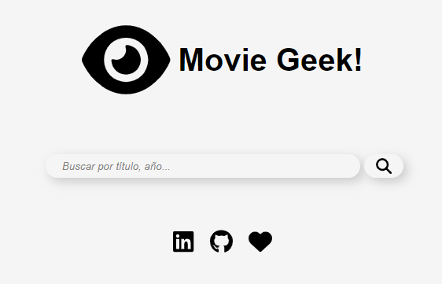
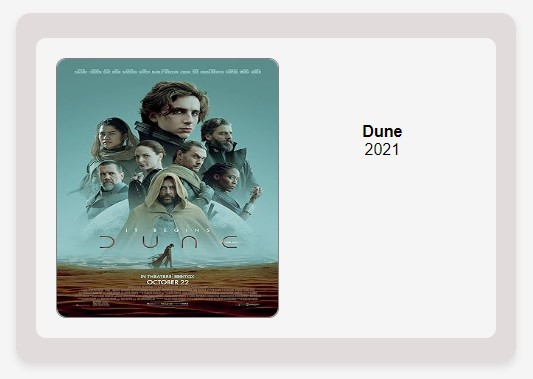

# MovieGeek!

MovieGeek! es una aplicación web simple que te permite buscar películas utilizando la API de películas [OMDb](https://www.omdbapi.com/). La aplicación está desarrollada utilizando Vanilla JavaScript y Fetch para obtener datos de la API.

## Uso

1. Para comenzar a utilizar MovieGeek!, accede al siguiente enlace: [MovieGeek!](https://tamaracontreras.github.io/DEV012-movie-challenge/).
3. En el campo de búsqueda, ingresa el título de la película que deseas buscar.
4. Presiona Enter o haz clic en el botón de búsqueda, cada vez que ingreses un parámetro.
5. La aplicación mostrará el título y el año de la primera película que coincida con tu búsqueda.
6. Puedes ver la consola de tu navegador y te mostrará los datos capturados por la API.

## Limitaciones
La API de OMDb tiene algunas limitaciones para las cuentas gratuitas. En este proyecto, sólo estamos mostrando el título y el año de la primera película que coincide con la búsqueda. Además, la API puede devolver resultados no tan precisos debido a la naturaleza de la búsqueda por palabra clave.

## Contribuciones
¡Todas las contribuciones son bienvenidas! Si deseas contribuir a este proyecto, siéntete libre de abrir problemas (issues) o enviar solicitudes de extracción (pull requests) para mejorar la funcionalidad o solucionar problemas.

## Agradecimientos
Desarrollado por [Tam] .
¡Gracias por usar MovieGeek!! Si tienes alguna pregunta o sugerencia, no dudes en abrir un issue en este repositorio.

